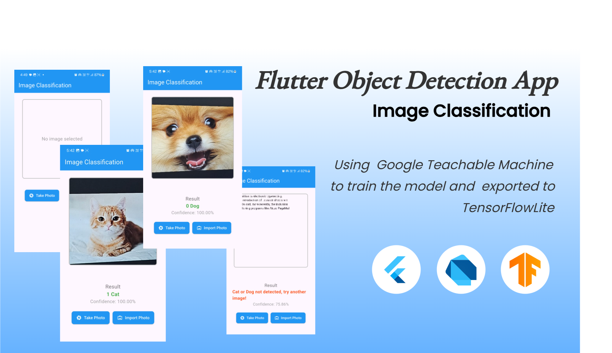

# Flutter Image Classification/ Object Detection App



An image classification/object detectection app using Google Teachable Machine to upload an image dataset for 2 classes: Cat and Dog. Trained and exported in TensorFlowLite file from which the home page is designed to make the model usable in a mobile app. User can import images both from camera and gallery.

## Documentation
- Train model at [Google Teachable Machine](https://teachablemachine.withgoogle.com/)
- Dataset is taken from [Kaggle](https://www.kaggle.com/datasets/samuelcortinhas/cats-and-dogs-image-classification)
- 279 images of Cats and 278 images of Dog is used to train the model.
- Confidence level is set at home_page.dart, if confidence level is low of < 0.9, then cat or dog isn't detected.
- Matrix is (1,2) since 2 classes were used, if more classes are used then need to make a change in the code line 110 in image_classifier.dart, to increase/decrease the class 'x' used
```bash
final output = List.filled(1 * x, 0.0).reshape([1, x]);
```


